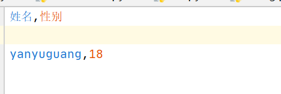

# Python

#### open中newLine的作用
写文件时，会自动在行之间加入一个空白行，newLine是将这个空白行去掉



#### str中的strip的作用

str中strip默认去掉头尾部的空格以及换行符
也可以传入特定的字符串(此时默认值不起作用)。

比如：
```python
str = 'python$'
print(str.strip("$")) #输出结果 python
```
#### list中的copy
```python
list2 = list1.copy()
print(list2) # 元素跟list1一致
```

#### dict中的copy
```python
dict2 = dict1.copy()
print(dict2) # 元素跟dict1一致
```

#### dict中的in
dict中的in表示key是否在这个字典中
表达式：
key in dict
```python
dict ={'x':'y'}
print('x' in dict) # True
print('z' in dict) # False
```

#### list中的in
list中的in表示list中是否有这个元素
表达式：
element in list
```python
list =['x','y']
print('x' in list) # True
print('z' in list) # False
```

#### dict获取两种元素的方式
1. dict['key]
2. dict.get('key')

```python
dict ={'x':'y'}
print("x 's value:", dict['x']) # 'y'
print("x 's value:", dict.get('x')) # 'y'
```

#### dict中的字典生成式
我们可以用字典生成式,从一个原有的字典生成一个新的字典。

表达式：
{key: value for key,value in dict if conditions..}

注意：字典生成式的括号式{}，表示这是字典
```python
my_dictionary = {'customer7': 7, 'customer2': 9, 'customer3': 11}

my_results = {key: value for key, value in my_dictionary.items() if (value > 10 and key == 'customer3')}
```

#### list中的列表生成式
我们可以使用列表生成式，从原有的列表生成一个新的列表。
newList = [x*x for x in oldList if condition..]

表示式：
注意：列表生成式的括号是中括号，表示这是个列表
```python
list = [1, 2, 3, 4]
newList = [x*x for x in list if x > 3]
```

### Pandas

#### loc以及iloc的区别

loc[索引名]: 表示提取特定索引名的行数据。

iloc[indexNumber]: indexNumber只能是数字，表示提取第indexNumber的数据

#### Series(一维数据)

pandas中类似于一维数据的对象。
Series对象的长度是不可以改变的。

Series可储存数据类型：可储存整数，浮点，字符串以及Python对象等类型。
轴标签称为索引。


```python
# 创建Series
s = pd.Series(data, index=index)
# data支持的数据类型: 1 Python字典 2 多维数组 3 标量值(如 5)
# index必须跟data的长度一致
```


#### DataFrame(二维数据)

DataFrame有行索引以及列索引.
是一个表格型的数据结构。
可由多个series组成。
DataFrame可以插入多列。

###### Column(列)

获取dataFrame中的列。
```python
for col in file_dataFrame.columns:
    series1 = file_dataFrame[col]
```
###### Index(行)

Pandas默认会在dataFrame标上递增的序列号。也可以直接指定Index和Column.


###### 获取子DataFrame

Pandas可以通过指定index以及column,生成子DataFrame
```python
childDataFrame = pd.DataFrame(parentDataFrame, index=['a', 'b'], columns=['one', 'two'])
```

#### 异构

异构： 由不同元素或部分组成。


 